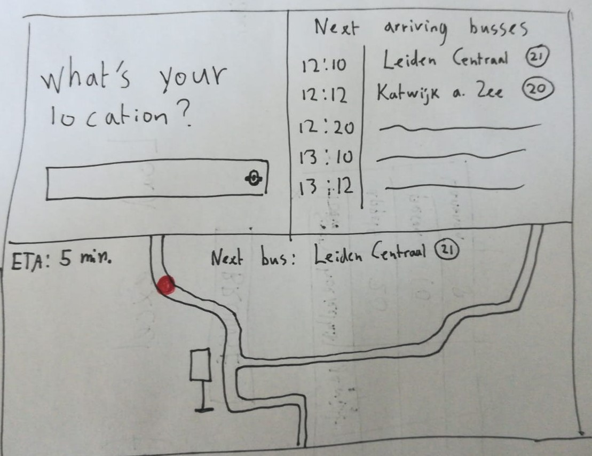

# bus-tracker
an application that shows when busses are expected to arrive at your location

## Contents
- [bus-tracker](#bus-tracker)
  - [Contents](#contents)
  - [Concept](#concept)
  - [Installation](#installation)
  - [First sketch](#first-sketch)
  - [Data Lifecycle](#data-lifecycle)
  - [API](#api)

## Concept
This application makes it easier to quickly check when your bus will depart. Instead of asking a lot of details about your journey like 9292ov.nl does, you can just type in the name of the bus stop and instantly see what busses will arrive shortly. If possible it will also show a map with the precise gps locations of those busses.

## Installation

To work on this project,
1. First clone this repository with git clone `https://github.com/lennartdeknikker/bus-tracker.git`.
2. Install the necessary dependencies with `npm install`
3. Use `npm run start` to start nodemon and view changes in the browser.

## First sketch

## Data Lifecycle

## API
This application makes use of real-time bus data provided by [NDOV Loket](https://ndovloket.nl/).
This data is only available for certain IP-addresses on their whitelist. To start using this API, visit [their website](https://ndovloket.nl/) and apply. They will then send you a document that needs to be signed and sent back. After that, you will receive a link to add your server's IP to their whitelist. When using Heroku to deploy this application, you will need to use a service like [Fixie](https://elements.heroku.com/addons/fixie) to obtain a static IP address. The free tier will reduce the amount of traffic your server can handle to 500 calls per month.

<!-- ## Events -->